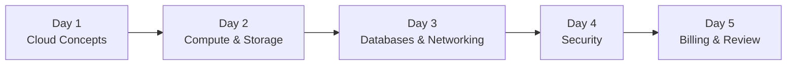
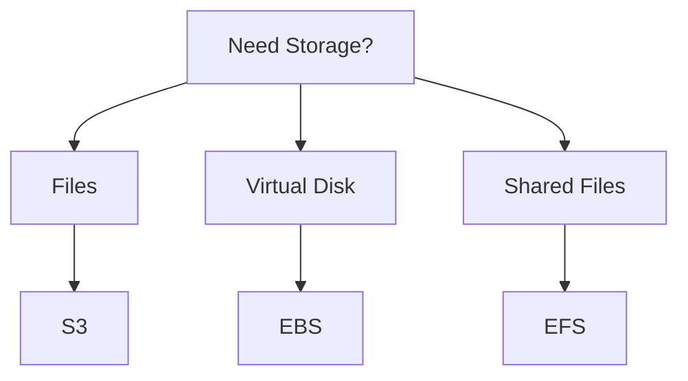
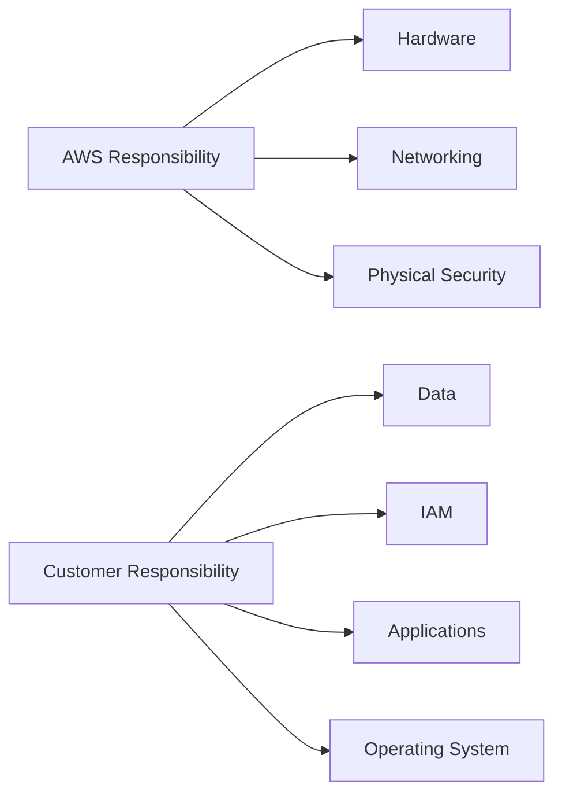
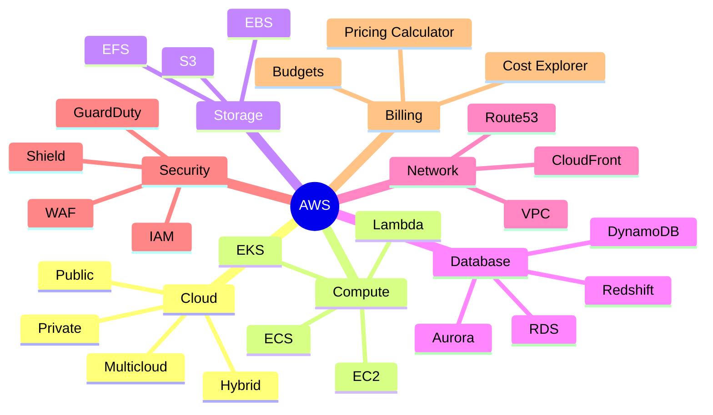

<p align="center">
  
</p>


# ☁️ AWS Crash Course (5-Day Roadmap)

> 🎯 **Goal:** Complete AWS fundamentals in **5 days** and prepare for the AWS Cloud Practitioner (CLF-C02) exam.

---

## 📚 Course Roadmap



---

# 📅 Day 1 — Cloud Concepts & Global Infrastructure

## 🎯 Topics Covered

- ☁️ What is Cloud Computing?
- 🏢 On-Premises vs Cloud
- 🌍 AWS Global Infrastructure
- 🌐 Regions & Availability Zones (AZs)
- 🚀 Benefits of Cloud

---

## Cloud Deployment Models

| Model | Description | Example |
|--------|-------------|----------|
| 🌍 Public Cloud | Infrastructure managed by AWS | AWS |
| 🏢 Private Cloud | Dedicated infrastructure | Company Datacenter |
| 🔀 Hybrid Cloud | Mix of Public + Private | AWS + Local Servers |
| ☁️ Multicloud | Multiple Cloud Providers | AWS + Azure + GCP |

---

## AWS Global Infrastructure

```text
AWS Region
│
├── Availability Zone A
├── Availability Zone B
└── Availability Zone C
```

💡 **Remember**

- Every Region has multiple AZs.
- AZs are isolated but connected.
- **US-East-1** is the oldest and most popular AWS Region.

---

## 🌟 Benefits of Cloud

- ⚡ Agility
- 💰 Cost Effective
- 📈 Scalability
- 🌍 Global Reach
- 🔒 Security
- 🤖 Automation
- 💾 Reliability

---

# 📅 Day 2 — Compute & Storage

## 💻 Compute Services

| Service | Use Case |
|----------|----------|
| EC2 | Virtual Machine |
| Lambda | Serverless Computing |
| ECS | Docker Containers |
| EKS | Kubernetes |

---

## Storage Services

| Service | Best For |
|----------|-----------|
| S3 | Object Storage |
| EBS | Virtual Hard Disk |
| EFS | Shared File Storage |

---

### Storage Decision



---

## Hands-on

✅ Create an S3 Bucket

✅ Upload Files

✅ Delete Files

---

# 📅 Day 3 — Databases & Networking

## Database Services

| Service | Type |
|----------|------|
| RDS | Relational Database |
| Aurora | High Performance SQL |
| DynamoDB | NoSQL |
| Redshift | Data Warehouse |
| ElastiCache | Caching |

---

## Networking

| Service | Purpose |
|----------|----------|
| VPC | Private Network |
| Route 53 | DNS |
| CloudFront | CDN |

---

## Direct Connect vs VPN

| Direct Connect | VPN |
|----------------|-----|
| Dedicated Connection | Internet Tunnel |
| Faster | Cheaper |
| More Reliable | Easy Setup |

---

## AWS Networking

```text
Internet
     │
 Route 53
     │
CloudFront
     │
   VPC
     │
EC2 / RDS / Lambda
```

---

# 📅 Day 4 — Security & Compliance

## Shared Responsibility Model



---

## IAM

IAM Components

- 👤 Users
- 👥 Groups
- 📜 Policies
- 🎭 Roles

---

## Security Best Practices

✅ Enable MFA on Root User

✅ Follow Least Privilege

✅ Rotate Credentials

---

## Security Services

| Service | Purpose |
|----------|----------|
| Shield | DDoS Protection |
| WAF | Web Application Firewall |
| GuardDuty | Threat Detection |

---

# 📅 Day 5 — Billing, Support & Review

## Billing Tools

| Tool | Purpose |
|------|----------|
| Cost Explorer | Analyse Spending |
| AWS Budgets | Set Budget Alerts |
| Pricing Calculator | Estimate Costs |

---

## Support Plans

| Plan | Best For |
|------|-----------|
| Basic | Free |
| Developer | Learning |
| Business | Companies |
| Enterprise | Large Organisations |

⭐ **Only Enterprise includes a Technical Account Manager (TAM).**

---

## AWS Trusted Advisor

- 💰 Cost Optimisation
- 🔐 Security
- ⚙️ Performance
- 🛡️ Fault Tolerance
- 📊 Service Limits

---

## Well-Architected Framework

```text
Operational Excellence
        │
Security
        │
Reliability
        │
Performance Efficiency
        │
Cost Optimisation
        │
Sustainability
```

---

# 📝 Final Checklist

- [ ] Cloud Concepts
- [ ] EC2
- [ ] Lambda
- [ ] S3
- [ ] EBS
- [ ] EFS
- [ ] RDS
- [ ] DynamoDB
- [ ] VPC
- [ ] Route 53
- [ ] CloudFront
- [ ] IAM
- [ ] Shared Responsibility
- [ ] Billing Tools
- [ ] Trusted Advisor
- [ ] Well-Architected Framework

---

# 🎯 Exam Tips

✅ Learn service use cases instead of memorising names.

✅ Practise creating an S3 bucket.

✅ Remember the Shared Responsibility Model.

✅ Understand the differences between EC2, Lambda, ECS, and EKS.

✅ Know which storage service fits each scenario.

---

# 📖 Quick Revision



---

# 📚 Practice

👉 Take a free AWS Cloud Practitioner practice test before the real exam.

---

## ⭐ Keep Learning

> **"Don't memorise AWS services—understand when and why to use them."**

---

Made with ❤️ for AWS Cloud Practitioner Preparation.
