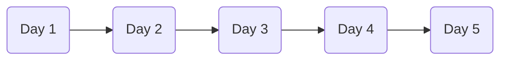

<p align="center">
  
</p>

<h1 align="center">☁️ AWS Cloud Practitioner Crash Course</h1>

<p align="center">
A beginner-friendly <b>5-Day AWS Crash Course</b> covering the most important AWS services, cloud fundamentals, security concepts, networking, storage, databases, billing, and exam preparation.
</p>

---

## 📖 Overview

This repository contains concise notes for the **AWS Certified Cloud Practitioner (CLF-C02)** certification.

Whether you're preparing for the exam or learning AWS from scratch, these notes focus on understanding **when and why to use AWS services** rather than memorising them.

---

## 📚 What You'll Learn

- ☁️ Cloud Computing Fundamentals
- 🌍 AWS Global Infrastructure
- 💻 Compute Services (EC2, Lambda, ECS, EKS)
- 💾 Storage Services (S3, EBS, EFS)
- 🗄️ Databases (RDS, Aurora, DynamoDB)
- 🌐 Networking (VPC, Route 53, CloudFront)
- 🔐 IAM & AWS Security
- 💰 Billing & Cost Optimisation
- 🏗️ AWS Well-Architected Framework
- ✅ Cloud Practitioner Exam Tips

---

## 🗓️ Learning Roadmap



| Day | Topics |
|------|--------|
| Day 1 | Cloud Concepts & Global Infrastructure |
| Day 2 | Compute & Storage |
| Day 3 | Databases & Networking |
| Day 4 | Security & IAM |
| Day 5 | Billing, Support & Final Review |

---

## 🖼️ AWS Overview

<p align="center">

</p>

---

## 📂 Repository Structure

```text
.
├── README.md
├── NOTE.md
└── assets/
    ├── aws-banner.png
    ├── aws-services-map.png
    ├── shared-responsibility.png
    └── aws-global-infrastructure.png
```

---

## 🎯 Who Is This For?

- Beginners learning AWS
- Students preparing for AWS Cloud Practitioner
- Developers starting with cloud computing
- Anyone looking for quick AWS revision notes

---

## ⭐ Topics Covered

- Cloud Computing
- AWS Infrastructure
- EC2
- Lambda
- S3
- EBS
- EFS
- RDS
- DynamoDB
- VPC
- Route 53
- CloudFront
- IAM
- Shield
- WAF
- GuardDuty
- Cost Explorer
- AWS Budgets
- Trusted Advisor

---

## 🚀 Start Learning

👉 Open **NOTE.md** to begin the complete 5-day learning roadmap.

---

<p align="center">
Made with ❤️ for AWS Learners
</p>
